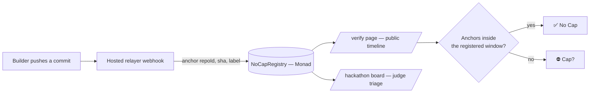

<div align="center">

# NoCap

**your build, no cap.**

Onchain build-provenance for hackathons. Connect GitHub once and a hosted relayer
anchors every commit fingerprint to Monad, so a build's real timeline is
**verifiable**, not claimed — and unlike a git timestamp, it can't be rewritten
after the fact.

[](#license)
[](https://testnet.monadexplorer.com)
[](#)

[Live app](https://nocap-protocol.vercel.app) · [Contracts](#deployed-contracts--monad-testnet) · [Quick start](#quick-start) · [Setup guide](HOSTED_RELAYER_SETUP.md)

</div>

---

## Why

Spark's own judging rules check whether a submission "started before registration"
and flag suspicious commits — using git timestamps, which are trivially rewritable
(`git commit --date`, rebase, force-push) by the person being judged. GitHub is both
the trusted witness *and* a party with full write access to its own history.

NoCap replaces that with a witness nobody can quietly edit: once a commit SHA is
anchored in a Monad block, "this exact commit existed at this block time" is fixed
by consensus, not by the submitter's word. It's an upper-bound proof — it can't show
code didn't exist earlier — but it makes the one thing judges actually check
(*rewriting history to predate registration*) impossible, and every anchor is public
and independently re-verifiable against the raw chain logs.



---

## What ships

| Role | Flow |
|---|---|
| **Organizer** | `/organizer` → seed a hackathon window (permissionless, first-slug-wins) → share the judge board |
| **Builder** | `/register` → connect GitHub, pick a repo, sign once → every push auto-anchors, zero secrets |
| **Judge** | `/hackathons` → browse every live event → drill into `/verify/{owner}/{repoId}` for a timeline, anomaly flags, and a pass/fail badge |

### Features

- **`NoCapRegistry`** — project registration, contributor authorization, event-only commit anchors
- **`HackathonRegistry`** — permissionless, reusable time windows; any number of hackathons run concurrently
- **`NoCapBadge`** — soulbound "Certified No Cap" NFT; optimistic claim, always mints to the repo's real owner
- **Hosted relayer** — GitHub App + webhook auto-anchors every push with zero secrets in the builder's repo; opt-in per repo, admin-rotatable in one transaction, rate-limited and idempotent
- **Judge tooling** — live hackathon directory, per-event pulse stats, per-repo "build rhythm" analytics, timing-anomaly flags — all derived from onchain data, never from reading code
- **Embed widget** — a drop-in badge (`/embed/{owner}/{repoId}`) for other platforms
- **Forensic report API** — `GET /api/report/{owner}/{repoId}` — full JSON export of a project's timeline

**Trust model, stated plainly:** the default attester is the **hosted relayer**, a per-repo-opt-in key, not the human author's personal wallet. An anchor proves *"NoCap's relayer attested this SHA at this block time for a repo that opted in,"* not *"Alice personally signed this commit."* That's the right trust model for hackathon provenance — worth saying out loud in every demo, not leaving implicit.

---

## Deployed contracts — Monad testnet

| Contract | Address |
|---|---|
| `NoCapRegistry` | [`0x4931e958ac49919177E53e88DD4C7cE4D27a36E3`](https://testnet.monadexplorer.com/address/0x4931e958ac49919177E53e88DD4C7cE4D27a36E3) |
| `HackathonRegistry` | [`0xfA6A1648bdd63088b105ceFE5C150a09Ba0f5043`](https://testnet.monadexplorer.com/address/0xfA6A1648bdd63088b105ceFE5C150a09Ba0f5043) |
| `NoCapBadge` | [`0x6371375a18f7c810fa6313084FE98aD1b6326224`](https://testnet.monadexplorer.com/address/0x6371375a18f7c810fa6313084FE98aD1b6326224) |

Chain id `10143` · RPC `https://testnet-rpc.monad.xyz` · both `NoCapRegistry` and
`NoCapBadge` are verified on Sourcify/MonadVision/MonadScan. Full deployment record
in [`deployments/monad-testnet.json`](deployments/monad-testnet.json).

---

## Monorepo layout

```
NoCap/
  contracts/                Foundry — NoCapRegistry, HackathonRegistry, NoCapBadge
  packages/shared/          computeRepoId, ABIs, window + timing analytics
  apps/web/                 Next.js app — frontend + hosted-relayer API routes
  HOSTED_RELAYER_SETUP.md   GitHub App + deploy checklist
  PRODUCT.md / DESIGN.md    brand + visual system
```

---

## Quick start

### 1. Contracts

```bash
cd contracts
forge test          # 19 tests
```

Deploy a fresh stack (or point at the addresses above and skip this):

```bash
forge script script/Deploy.s.sol:Deploy \
  --rpc-url https://testnet-rpc.monad.xyz --account nocap-deployer --broadcast
```

### 2. Web app

```bash
npm install
cp apps/web/.env.example apps/web/.env.local   # fill in addresses
npm run dev
```

Open **http://localhost:3000**.

### 3. Register a project

Connect a wallet → `/register` → **Connect GitHub** → pick your repo → sign once.
A hosted relayer watches pushes via a GitHub webhook and anchors every commit
automatically — no keys to generate, no workflow file to add. Needs the GitHub App
set up once — see [`HOSTED_RELAYER_SETUP.md`](HOSTED_RELAYER_SETUP.md) for the
exact steps and what's already verified working live on testnet.

---

## How it fits together

- **Canonical `repoId`** — one helper, everywhere: `keccak256(utf8(lowercase("owner/repo")))`, no `https://` prefix, no trailing slash. A mismatch between the webhook handler and the frontend means an empty verify page with no obvious cause, so `packages/shared` is the single source of truth every caller imports.
- **Multi-hackathon by default** — a repo registers under one `hackathonId`; boards, verify pages, and badge eligibility all scope to that project's own window. Any number of events run concurrently without colliding.
- **Anomaly signals are advisory, never a verdict** — timing heuristics (late bursts, compressed spans, pre-window anchors) are surfaced on `/verify` and never auto-disqualify anything.
- **Badge is an optimistic, publicly-checkable claim** — `claimBadge` is permissionless and always mints to the repo's registered owner (never the caller), so anyone — including the hosted relayer — can trigger it once eligible without risk of stealing someone else's badge.

---

## Security rails

- Relayer wallet only — never a funded personal wallet, never reused across purposes
- Private keys live only in server-side env vars — never in frontend code, never committed
- `anchor()` gated by a per-repo opt-in `relayerEnabled` flag — a compromised relayer key can only touch repos that explicitly opted in, never every project on the registry
- Relayer key is admin-rotatable — one transaction re-authorizes every opted-in repo, no per-project migration
- No source code, no file contents, no PII ever touches the chain — only hashes and short labels

---

## Roadmap (all phases shipped)

| Phase | Status |
|---|---|
| 0 · Setup | Foundry + monorepo scaffolding |
| 1 · MVP | Registry, anchoring, landing + verify page, window badge |
| 2 · Expansion | HackathonRegistry, multi-contributor, register/dashboard |
| 2.5 · Discovery | Hackathon directory, chunked log scanning, per-event stats |
| 3 · Stretch | Embed widget, soulbound badge, anomaly flags, forensic report API |
| 4 · Hosted relayer | GitHub App, webhook auto-anchor, one-signature registration |

---

## Demo script (&lt; 3 min)

1. Register a project — connect GitHub, pick the repo, sign once
2. Push a commit on camera
3. Show the anchor land — open `/verify`, watch the timeline update
4. Point at the green **No Cap** badge
5. Flash the judge board across a couple of live hackathons

*I built a tool that proves hackathon submissions aren't backdated, then used it to prove this one isn't — no cap.*

---

## License

MIT
