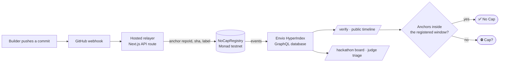

<div align="center">

# NoCap

### your build, no cap.

**Onchain build-provenance for hackathons.** Connect a GitHub repo once and a hosted
relayer anchors every commit fingerprint to Monad — so a build's real timeline is
**verifiable by consensus**, not claimed. Unlike a git timestamp, an onchain anchor
can't be rewritten, rebased, or backdated after the fact.

[](#license)
[](https://testnet.monadexplorer.com)
[](#)
[](contracts)
[](indexer)

**[▶ Live app](https://nocap-protocol.vercel.app)** · [Contracts](#deployed-contracts--monad-testnet) · [Architecture](#architecture) · [Quick start](#quick-start)

<br/>

**NoCap proving NoCap** — this repository's own build history is anchored on Monad. The badge below is live, served by this project's own API:

[](https://nocap-protocol.vercel.app/verify/0xa5064e866f04979cfb891a50c29eb9b7961d7832/0x5f008635f0e0ee44d497b1cba7bac6f783566a735ffa7bea950915c49eef1ee2)

</div>

---

## The problem

Hackathon judging rules routinely check whether a submission *"started before the
event began"* and flag suspicious commit histories. But that check relies on **git
timestamps — which the person being judged can trivially rewrite** (`git commit
--date`, an interactive rebase, a force-push). GitHub is both the trusted witness
*and* a party with full write access to the very history it's vouching for.

## The fix

NoCap replaces that self-attested timestamp with a witness nobody can quietly edit.
Once a commit SHA is anchored in a Monad block, *"this exact commit existed at this
block time"* is fixed by consensus. It's an **upper-bound proof** — it can't show
code didn't exist *earlier* — but it makes the one thing judges actually check,
**rewriting history to predate registration, impossible**. Every anchor is public
and independently re-verifiable against the raw chain logs.

> **Trust model, stated plainly.** The attester is NoCap's **hosted relayer** (a
> per-repo opt-in key), not the author's personal wallet. An anchor proves *"the
> relayer witnessed this SHA at this block time for a repo that opted in"* — not
> *"Alice personally wrote this commit."* That's exactly the right claim for
> provenance: it establishes **when**, and leaves authorship to the code review.

---

## Architecture



**Write path** — a builder connects a repo (one signature, no keys, no secrets in
their repo). GitHub's webhook fires on every push; the relayer verifies the HMAC
signature, acknowledges fast, and anchors each commit asynchronously.

**Read path** — an [Envio HyperIndex](indexer) indexer ingests the contract events
into a GraphQL database. The frontend queries that index, so timelines and judge
boards load instantly with no per-request chain scanning and no RPC rate limits.

---

## Who it's for

| Role | Flow |
|---|---|
| **Builder** | `/register` → connect GitHub → pick a repo → sign once. Every push auto-anchors. Zero secrets, zero CI config. |
| **Judge** | `/hackathons` → browse live events → open `/verify/{owner}/{repoId}` for a timeline, timing-anomaly flags, and a pass/fail badge. No wallet needed. |
| **Organizer** | `/organizer` → seed a hackathon window (permissionless, first-slug-wins) → share the judge board. |

### What's in the box

- **`NoCapRegistry`** — project registration, per-repo relayer opt-in, event-only commit anchors
- **`HackathonRegistry`** — permissionless, reusable time windows; any number of hackathons run concurrently
- **`NoCapBadge`** — soulbound "Certified No Cap" NFT; permissionless to trigger, always mints to the repo's registered owner
- **Hosted relayer** — GitHub App + webhook auto-anchors every push; opt-in per repo, admin-rotatable in one transaction, idempotent and rate-limited
- **Envio indexer** — contract events → GraphQL, so every list is an indexed query, not a chain scan
- **Judge tooling** — live hackathon directory, per-event pulse stats, per-repo "build rhythm" analytics, advisory timing-anomaly flags — all derived from onchain data, never from reading code
- **Embed widget** — a drop-in badge (`/embed/{owner}/{repoId}`) for submission pages and READMEs
- **Forensic report API** — `GET /api/report/{owner}/{repoId}` — full JSON export of a project's timeline

---

## Deployed contracts — Monad testnet

| Contract | Address |
|---|---|
| `NoCapRegistry` | [`0x4931e958ac49919177E53e88DD4C7cE4D27a36E3`](https://testnet.monadexplorer.com/address/0x4931e958ac49919177E53e88DD4C7cE4D27a36E3) |
| `HackathonRegistry` | [`0xfA6A1648bdd63088b105ceFE5C150a09Ba0f5043`](https://testnet.monadexplorer.com/address/0xfA6A1648bdd63088b105ceFE5C150a09Ba0f5043) |
| `NoCapBadge` | [`0x6371375a18f7c810fa6313084FE98aD1b6326224`](https://testnet.monadexplorer.com/address/0x6371375a18f7c810fa6313084FE98aD1b6326224) |

Chain id `10143` · RPC `https://testnet-rpc.monad.xyz` · full source in
[`contracts/`](contracts) · complete deployment record (addresses, deploy blocks,
relayer) in [`deployments/monad-testnet.json`](deployments/monad-testnet.json).

---

## Repository layout

```
NoCap/
├── contracts/       Foundry — NoCapRegistry, HackathonRegistry, NoCapBadge (+ tests)
├── packages/
│   └── shared/      computeRepoId, contract ABIs, window + timing analytics
├── apps/
│   └── web/         Next.js 15 app — frontend + hosted-relayer API routes
├── indexer/         Envio HyperIndex — events → GraphQL (see indexer/DEPLOY.md)
└── deployments/     onchain deployment record
```

---

## Quick start

**1. Contracts**

```bash
cd contracts
forge test          # 19 passing tests
```

Deploy a fresh stack (or point at the addresses above and skip):

```bash
forge script script/Deploy.s.sol:Deploy \
  --rpc-url https://testnet-rpc.monad.xyz --account nocap-deployer --broadcast
```

**2. Web app**

```bash
npm install
cp apps/web/.env.example apps/web/.env.local   # fill in addresses + endpoints
npm run dev                                     # → http://localhost:3000
```

**3. Register a project**

Connect a wallet → `/register` → **Connect GitHub** → pick your repo → sign once.
The hosted relayer watches pushes via webhook and anchors every commit — no keys to
generate, no workflow file to add. Requires the GitHub App and relayer to be
configured once; see [`HOSTED_RELAYER_SETUP.md`](HOSTED_RELAYER_SETUP.md).

**4. Indexer** (optional for local dev, powers fast reads in production)

Deploy the Envio indexer and point the app at its GraphQL URL — see
[`indexer/DEPLOY.md`](indexer/DEPLOY.md). Without it, the app falls back to direct
log scanning automatically.

---

## Design decisions worth knowing

- **One canonical `repoId`** — `keccak256(utf8(lowercase("owner/repo")))`, no
  protocol prefix, no trailing slash. The webhook handler, the frontend, and the
  indexer all import the same helper from `packages/shared`, so an id can never
  drift between the write path and the read path.
- **Multi-hackathon by default** — a repo registers under one `hackathonId`; boards,
  verify pages, and badge eligibility all scope to that project's own window. Events
  run concurrently without colliding.
- **Anomaly signals are advisory, never a verdict** — late bursts, compressed spans,
  and pre-window anchors are surfaced on `/verify` but never auto-disqualify anyone.
  NoCap reports; humans judge.
- **The badge can't be stolen** — `claimBadge` is permissionless to *call* but always
  mints to `repoOwner(repoId)`, never to `msg.sender`. Anyone (a teammate, the
  relayer) can trigger it once eligible; it always lands with the rightful owner.

---

## Security rails

- **Relayer key only** — never a funded personal wallet, never reused across purposes; lives only in server-side env, never in the client bundle or git.
- **Blast radius is bounded** — `anchor()` is gated by a per-repo opt-in `relayerEnabled` flag, so a compromised relayer key can only touch repos that explicitly opted in, never every project on the registry.
- **Rotatable in one transaction** — the admin can rotate the relayer key and re-authorize every opted-in repo atomically, with no per-project migration.
- **Nothing sensitive touches the chain** — only commit hashes and short labels are anchored; no source, no file contents, no PII.
- **The scan token never ships to the browser** — historical reads go through the server-side indexer/API, so no provider credential is ever inlined into client JavaScript.

---

## Tech stack

**Contracts** Solidity · Foundry · OpenZeppelin — deployed to Monad testnet
**Web** Next.js 15 (App Router) · React · viem · wagmi — deployed on Vercel
**Indexer** Envio HyperIndex → GraphQL
**Onchain reads/writes** viem against Monad testnet (chain id `10143`)

---

## Demo script (&lt; 3 min)

1. **Register** — connect GitHub, pick the repo, one signature.
2. **Build** — push a commit on camera.
3. **Prove** — open `/verify`, watch the anchor land on the timeline.
4. **Certify** — point at the green **No Cap** badge.
5. **Judge** — flash the board across a couple of live hackathons.

> *"I built a tool that proves hackathon submissions aren't backdated — then used it
> to prove this one isn't. No cap."*

---

## License

[MIT](#license) © 2026 NoCap
